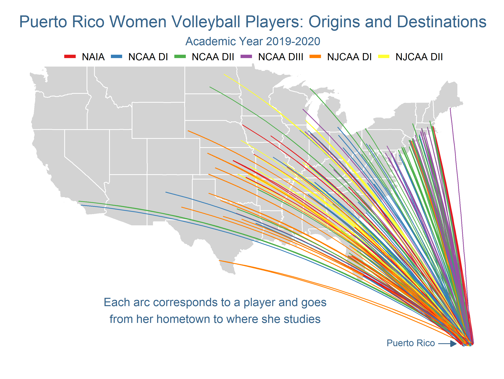
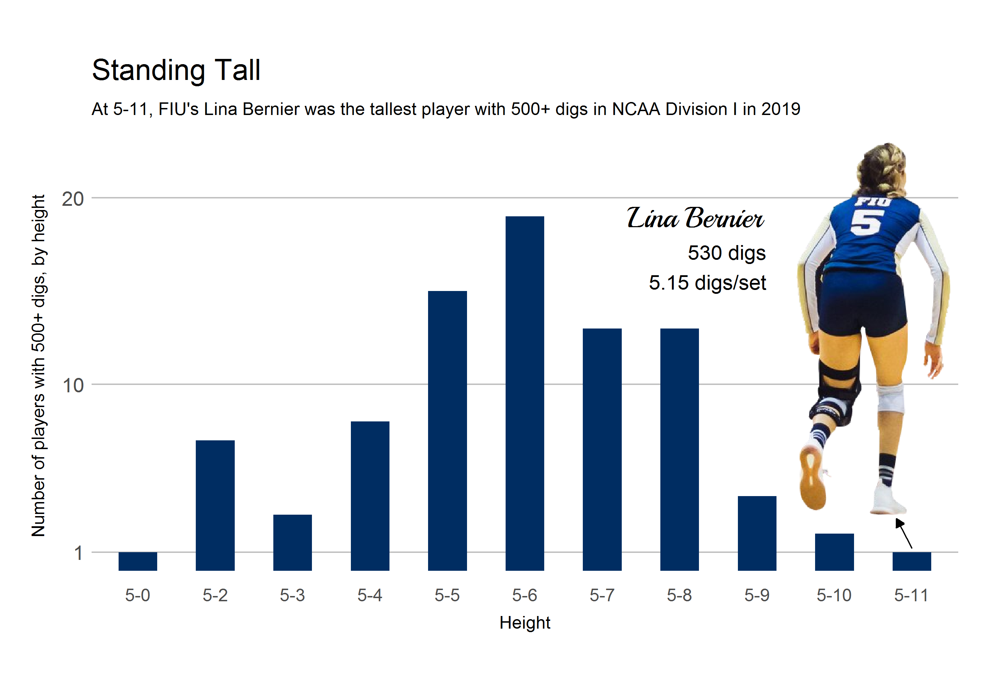

### Summary
This is the academic year 2019-2020 yearbook of Puerto Rico women's college volleyball players in the United States. It includes many maps and plots, all of which were created using **R**. The [document](https://github.com/carlosror/Boricuas_NCAA_Season_Summary_2019_2020/raw/master/Women/Final_doc_compressed.pdf), almost in its entirety (265 pages), was put together using the **Python** API for [**Scribus**](https://www.scribus.net/), an open-source desktop publishing program.

### Cover, table of contents, and executive summary

 
 
 

### Maps

All of the maps below were made using **R**.

#### Fill maps

Maps of where in Puerto Rico the players are from (municipality) and where they study in the U.S.

 

#### Map of arcs

Map that draws an arc for each player, from her hometown to the institution in which she studies

#### Bubble maps

Maps that indicate how many players by Puerto Rican municipality and by U.S. state

 

### Plots

All of the plots below were put together using **R**.

 

 

 

 

 

 

